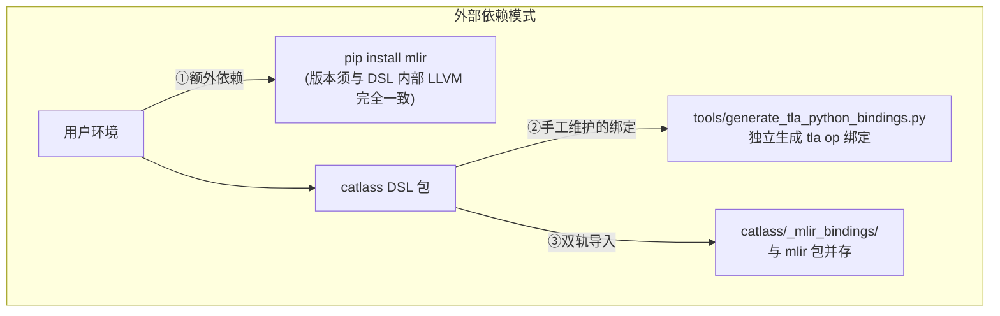
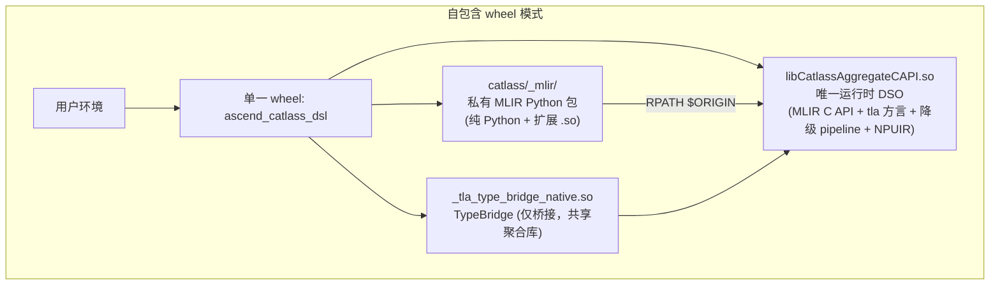
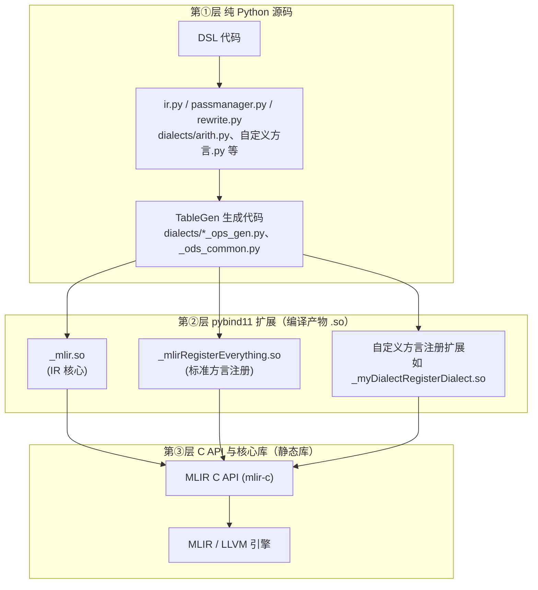
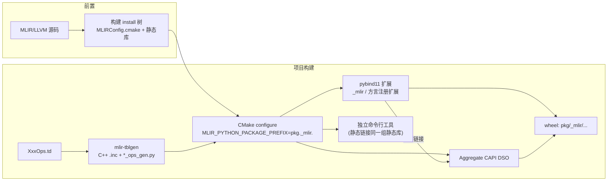
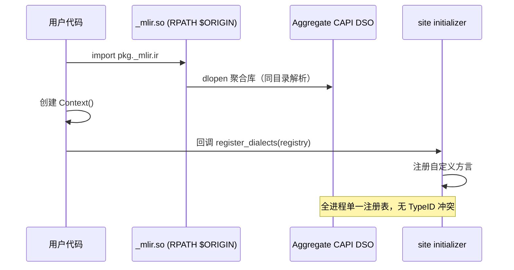
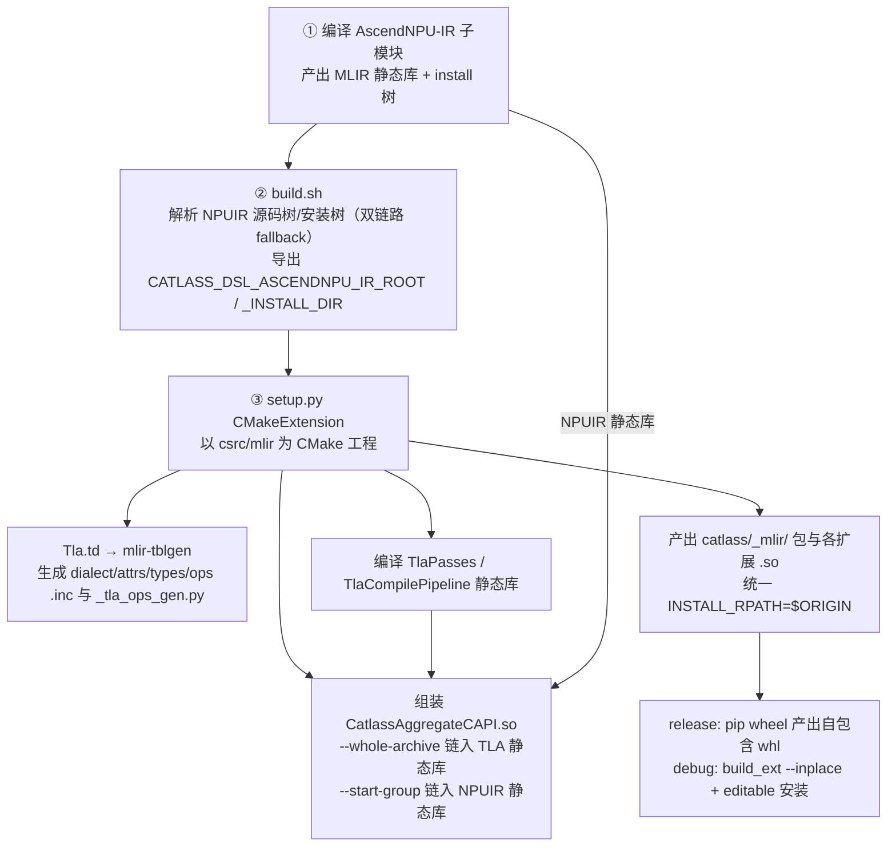
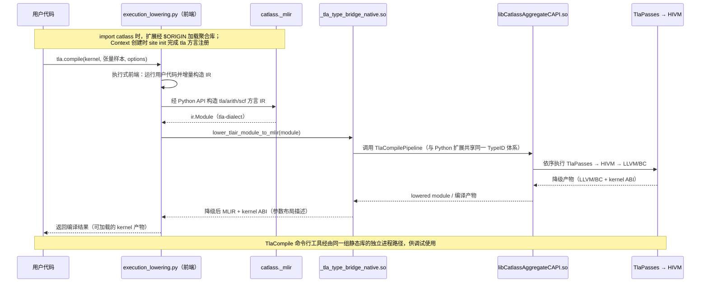
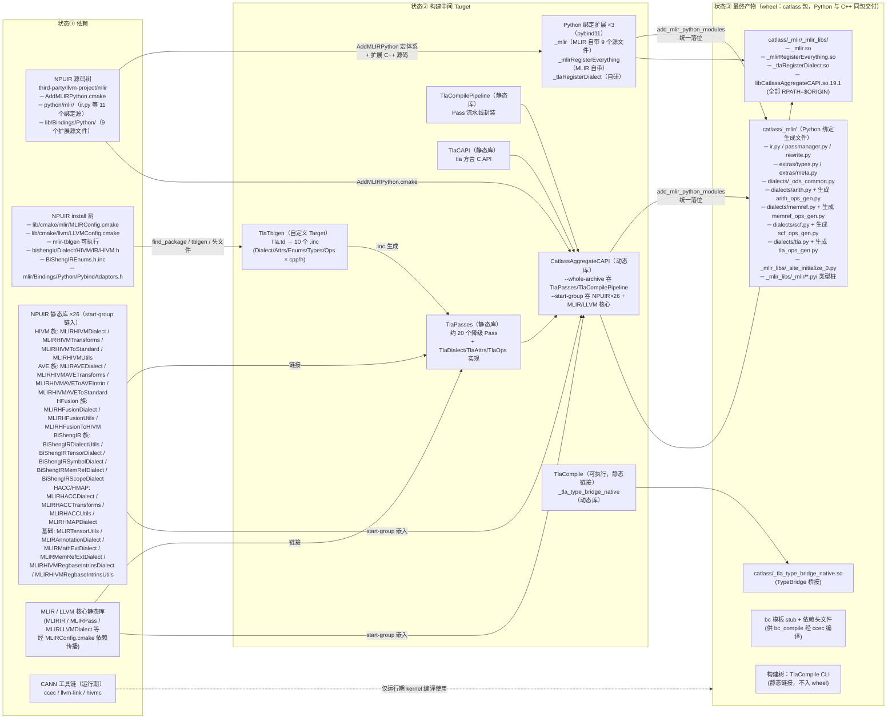
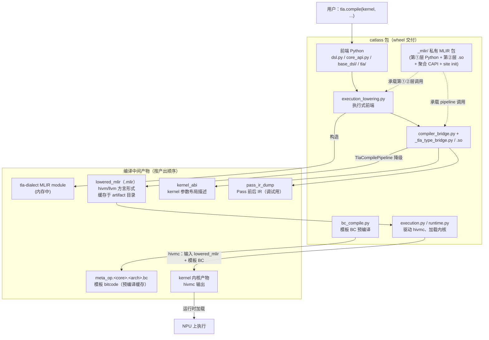

# TLA DSL 的 MLIR Python 集成设计

> 对象：CATLASS TLA DSL（`python/tla_dsl`）。
> 配套设计文档：<https://gitcode.com/yuantao_/catlass/issues/14>
> 落地版本：PR !1168（commit `a776bc06`，已合入 master）。

---

## 一、背景：DSL 编译链的构成

一个面向加速器硬件的 DSL，无论前端形态如何，都需要具备以下组件才能完成"用户代码 → 硬件可执行产物"的转换：


其中与本文直接相关的三个要素：

| 要素 | 作用 |
| --- | --- |
| **IR 基础设施** | 提供程序表示、类型系统、Pass 机制等编译器公共能力，避免从零自研。典型选择为 MLIR |
| **自定义方言** | 表达 DSL 的领域语义（如张量布局、拷贝、矩阵计算等） |
| **Python 层的 IR 接口** | 支持前端在 Python 进程中构造、检查、降级 IR，支撑诊断信息回溯与测试 |

第三点是一个共性设计问题：LLVM 社区没有为 MLIR Python 包提供稳定发布渠道，各 DSL 项目必须自行解决其获取、集成与分发。第二章先说明本项目对该问题的需求与设计目标，第三章介绍 MLIR 官方的打包机制，第四章给出本项目中的具体实现。

---

## 二、设计目标：从外部依赖到自包含交付

### 2.1 项目背景与既有架构的问题

TLA DSL 的前端是**执行式**的：用户调用 `tla.compile(kernel, ...)` 时，框架实际执行用户 Python 代码，边执行边通过 MLIR 的 Python API 用 `tla`/`arith`/`scf` 方言构造 IR（见 [execution_lowering.py](file:///home/yuantao/catlass/python/tla_dsl/catlass/execution_lowering.py)）。此外：

- 诊断信息需要映射回用户 Python 源码行（[compiler_bridge.py](file:///home/yuantao/catlass/python/tla_dsl/catlass/compiler_bridge.py#L34-L45)），依赖 MLIR Python 层的 Location/Diagnostic API；
- 测试需要直接检查方言 op 与类型。

因此 **MLIR Python bindings 是 TLA DSL 的硬依赖**。在该依赖的集成方式上，PR !1168 之前存在三个结构性问题：



| 问题 | 具体表现 |
| --- | --- |
| **外部版本耦合** | 用户必须安装与 DSL 编译时所用 LLVM 哈希严格匹配的 `mlir` Python 包，小版本偏差即导致 import 失败或 C API 不兼容 |
| **分发不自包含** | wheel 仅包含 DSL 本体，运行时依赖外部包，部署流程繁琐且易错 |
| **绑定双轨制** | tla op 绑定走独立生成脚本，与 MLIR 官方 ODS 生成体系脱节；`_mlir_bindings` 与 `mlir` 包两套导入并存，维护成本高 |

### 2.2 设计目标

| 目标 | 达成方式 |
| --- | --- |
| 单一 wheel 自包含 | `pip install` DSL 后即可使用，无外部 MLIR 包依赖 |
| 版本锁定 | MLIR/LLVM 版本由 AscendNPU-IR 子模块锁定，不随上游漂移 |
| 命名空间隔离 | 导入路径统一为 `catlass._mlir.*`，与用户环境中任何 `mlir` 包物理隔离 |
| 绑定体系统一 | tla 方言并入 MLIR ODS/TableGen 生成体系，废弃独立生成脚本 |
| 注册唯一性 | 全进程单一 MLIR C API 副本，消除重复 TypeID 崩溃风险 |

### 2.3 目标架构



这一目标架构与 IREE、CIRCT、BiShengIR 等 MLIR 生态项目的做法一致（区别于 Triton 将 MLIR 完全封装于 C++ 的方案——TLA 前端为执行式，需要 Python 层 IR 操作能力）。

---

## 三、原理：MLIR 的 Python 打包机制

目标架构的全部能力来自 MLIR 官方提供的 Python 集成设施，本章介绍其工作原理。

### 3.1 三层架构

MLIR 的 Python 支持由三层组成：



- 第①层为纯 Python，提供面向用户的 API 门面；
- 第②层为编译出的 pybind11 扩展，承担 Python 对象与 C 指针之间的转换；
- 第③层为静态库形态的 C API 与引擎本体，是所有语言绑定的共同基础。

三层缺一不可：仅分发第①层 Python 文件无法运行。

### 3.2 组装设施：AddMLIRPython.cmake

MLIR 源码树（`mlir/cmake/modules/AddMLIRPython.cmake`）提供了一整套 CMake 宏，覆盖上述三层的声明、编译与组装：

| 宏 | 职责 |
| --- | --- |
| `declare_mlir_python_sources` | 声明第①层 Python 源文件（手写 + 生成） |
| `declare_mlir_dialect_python_bindings` | 给定 `XxxOps.td`，调用 `mlir-tblgen` 生成 `xxx_ops_gen.py` 并挂载到方言包，保证 C++/Python 两端一致 |
| `declare_mlir_python_extension` | 声明第②层一个 pybind11 扩展及其 `EMBED_CAPI_LINK_LIBS` |
| `add_mlir_python_common_capi_library` | 将所有扩展引用的 C API 静态库聚合为**单一**运行时 DSO |
| `add_mlir_python_modules` | 按包结构落位全部模块与扩展，扩展自动链接聚合库 |

三个关键机制：

1. **`MLIR_PYTHON_PACKAGE_PREFIX`**：编译期宏，将包名从 `mlir.*` 重写为私有命名空间（如 `pkg._mlir.*`），作用于 Python 源与扩展两侧，实现与环境中其他 MLIR 包的物理隔离。
2. **Site initializer**（`_site_initialize_N.py`）：MLIR 构造 `Context` 时回调的注册钩子，通过 `register_dialects(registry)` 完成方言预注册，用户无需手工加载方言。
3. **聚合 CAPI**：MLIR 依赖进程级全局注册表（Type 侧以 TypeID 标识）。若多个扩展各自静态链接一份 C API，同一类型将获得不同 TypeID，首次跨扩展传递即崩溃。聚合库使全部扩展动态链接同一 DSO，保证每进程仅一份注册。

扩展的 `INSTALL_RPATH` 设为 `$ORIGIN`（在自身所在目录解析依赖），使 wheel 在任意机器上均可正确加载聚合库。

### 3.3 构建与运行时流程





---

## 四、实现：TLA DSL 中的落地

### 4.1 代码布局

```text
python/tla_dsl/
├── build.sh                      # 构建入口：解析依赖路径并导出环境变量
├── setup.py                      # 打包层：CMake 构建接入 wheel 流程
├── catlass/                      # DSL Python 包
│   ├── execution_lowering.py     # 执行式前端：构造 tla/arith/scf IR
│   ├── _tla_type_bridge.py       # TypeBridge 的 Python 侧（加载 .so）
│   ├── _tla_type_bridge_native.*.so   # TypeBridge C++ 实现（仅桥接）
│   └── _mlir/                    # 私有 MLIR 包（构建时生成，gitignore）
│       ├── ir.py / dialects/     # 第①层
│       └── _mlir_libs/           # 第②层扩展 + 聚合 CAPI + site init
└── csrc/mlir/                    # C++ / CMake 源码
    ├── CMakeLists.txt            # 定位 NPUIR、TableGen、包名私有化
    ├── include/Dialect/Tla/IR/Tla.td   # tla 方言定义（单源生成 C++/Python）
    ├── lib/Dialect/Tla/          # tla 方言 C++ 实现
    ├── lib/Passes/               # TLA → HIVM 降级 Pass
    ├── lib/Tools/CompilePipeline.cpp   # Pass 流水线封装
    ├── lib/CAPI/Dialect/Tla.cpp  # tla 方言 C API
    ├── python/CMakeLists.txt     # Python bindings 组装配置
    ├── python/bindings/RegisterTlaDialect.cpp  # 方言注册扩展
    ├── python/catlass_mlir/      # 私有包手写 Python（site init 等）
    └── tools/tla-compile/main.cpp      # 独立命令行编译工具
```

> **NPUIR 说明**：`3rdparty/AscendNPU-IR/` 子模块为华为 NPU 编译器底座，内含 MLIR/LLVM 源码及 HIVM、HFusion 等 NPU 方言。本项目经由它获取 MLIR 本体，因此构建前需先完成其编译。

### 4.2 构建链路



第三章机制与实现的对照关系：

| 第三章机制 | 代码落点 |
| --- | --- |
| `MLIR_PYTHON_PACKAGE_PREFIX` 私有化 | [csrc/mlir/CMakeLists.txt L224](file:///home/yuantao/catlass/python/tla_dsl/csrc/mlir/CMakeLists.txt#L224) |
| NPUIR 头文件/静态库校验 | [csrc/mlir/CMakeLists.txt L45-95](file:///home/yuantao/catlass/python/tla_dsl/csrc/mlir/CMakeLists.txt#L45-L95) |
| TableGen 自定义命令 | [csrc/mlir/CMakeLists.txt L181-219](file:///home/yuantao/catlass/python/tla_dsl/csrc/mlir/CMakeLists.txt#L181-L219) |
| include AddMLIRPython.cmake（源码树，install 树不含此文件） | [python/CMakeLists.txt L5-12](file:///home/yuantao/catlass/python/tla_dsl/csrc/mlir/python/CMakeLists.txt#L5-L12) |
| 标准方言（arith/memref/scf）与核心扩展声明 | [python/CMakeLists.txt L14-96](file:///home/yuantao/catlass/python/tla_dsl/csrc/mlir/python/CMakeLists.txt#L14-L96) |
| tla 方言：`.td` 定义 + C API + 注册扩展 + site init | [Tla.td](file:///home/yuantao/catlass/python/tla_dsl/csrc/mlir/include/Dialect/Tla/IR/Tla.td)、[lib/CAPI](file:///home/yuantao/catlass/python/tla_dsl/csrc/mlir/lib/CAPI/CMakeLists.txt)、[RegisterTlaDialect.cpp](file:///home/yuantao/catlass/python/tla_dsl/csrc/mlir/python/bindings/RegisterTlaDialect.cpp)、[_site_initialize_0.py](file:///home/yuantao/catlass/python/tla_dsl/csrc/mlir/python/catlass_mlir/_mlir_libs/_site_initialize_0.py) |
| 聚合 CAPI 与 `$ORIGIN` | [python/CMakeLists.txt L145-195](file:///home/yuantao/catlass/python/tla_dsl/csrc/mlir/python/CMakeLists.txt#L145-L195) |
| 独立工具（静态链接，与 Python 运行时隔离） | [tools/tla-compile/main.cpp](file:///home/yuantao/catlass/python/tla_dsl/csrc/mlir/tools/tla-compile/main.cpp) |
| 打包与构建入口 | [setup.py L300-306](file:///home/yuantao/catlass/python/tla_dsl/setup.py#L300-L306)、[build.sh](file:///home/yuantao/catlass/python/tla_dsl/build.sh) |

同时，DSL 全部前端代码的导入路径统一收敛至私有命名空间（`from catlass._mlir import ir`、`from catlass._mlir.dialects import arith/scf/tla`），涉及 `base_dsl/*`、`tla/*` 等 40 余处；TypeBridge（[_tla_type_bridge.py](file:///home/yuantao/catlass/python/tla_dsl/catlass/_tla_type_bridge.py#L331-L354)）的职责收敛为纯 Python/C++ 桥接，编译链依赖全部移入聚合 CAPI。

### 4.3 端到端编译数据流

以 `tla.compile(kernel, ...)` 为例：



### 4.4 交付物清单

| 产物 | 位置 | 说明 |
| --- | --- | --- |
| `libCatlassAggregateCAPI.so.19.1` | `catlass/_mlir/_mlir_libs/` | 唯一运行时 DSO：MLIR C API + tla 方言 + 降级 pipeline + NPUIR |
| `_mlir` / `_mlirRegisterEverything` / `_tlaRegisterDialect` 扩展 | `catlass/_mlir/_mlir_libs/` | pybind11 扩展，动态链接聚合库 |
| `_tla_ops_gen.py` 等生成代码 | `catlass/_mlir/dialects/` | tla/arith/scf 方言 Python 绑定（ODS 生成） |
| `_tla_type_bridge_native.*.so` | `catlass/` 包根 | TypeBridge，仅承担类型桥接 |
| `TlaCompile` | 构建树（不进 wheel） | 命令行调试工具，静态链接 |

### 4.5 验证与维护

**验证手段**：Python import 冒烟、`tla` 方言注册检查、DSL pytest（[tests/_bootstrap.py](file:///home/yuantao/catlass/python/tla_dsl/tests/_bootstrap.py) 引导私有命名空间）、`TlaCompile` 工具链验证、Ascend950 `basic_mmad` 端到端用例、文档构建。

**维护规则**：

1. MLIR/LLVM 版本由 AscendNPU-IR 子模块锁定；子模块升级后需重新编译 NPUIR 与 CATLASS；
2. 新增标准方言：在 [csrc/mlir/python/CMakeLists.txt](file:///home/yuantao/catlass/python/tla_dsl/csrc/mlir/python/CMakeLists.txt) 追加 `declare_mlir_dialect_python_bindings` 声明；
3. 新增 tla 操作：修改 [Tla.td](file:///home/yuantao/catlass/python/tla_dsl/csrc/mlir/include/Dialect/Tla/IR/Tla.td) 后重新构建，tblgen 自动同步 C++ 与 Python 两端。

---

## 五、整体编译架构与产物总览

### 5.1 编译架构全景：依赖 → 构建 Target → 最终产物

三个子图对应三个状态：**依赖什么 → 构建出哪些中间 Target → 最终交付什么**。



各 Target 的职责：

| Target | 形态 | 职责 |
| --- | --- | --- |
| `TlaTblgen` | 自定义 Target | `Tla.td` 单源生成 10 个 `.inc`（Dialect/Attrs/Enums/Types/Ops 各 cpp/h），C++ 与 Python 两端共用 |
| `TlaPasses` | 静态库 | 约 20 个降级 Pass + tla 方言实现；链接 NPUIR 26 个静态库与 MLIR/LLVM 核心 |
| `TlaCompilePipeline` | 静态库 | Pass 流水线封装，对上层暴露单次降级入口 |
| `TlaCAPI` | 静态库 | tla 方言 C API，供 `_tlaRegisterDialect` 扩展嵌入 |
| `CatlassAggregateCAPI` | 动态库 | 唯一运行时 DSO：嵌入 MLIR C API + TLA 编译核心 + NPUIR 26 库，保证全进程单一 TypeID 体系 |
| `_mlir` / `_mlirRegisterEverything` / `_tlaRegisterDialect` | pybind11 扩展 | 前两者源码取自 NPUIR 源码树（即 MLIR 官方绑定源），后者为自研方言注册扩展（`EMBED_CAPI_LINK_LIBS TlaCAPI`） |
| `CatlassPythonModules` | Python 模块集 | `add_mlir_python_modules` 将全部 Python 源 + 3 个扩展按 `catlass/_mlir/` 布局落位，扩展自动链接聚合库 |
| `_tla_type_bridge_native` | 动态库 | Python 前端调用降级 pipeline 的桥接（诊断映射、结果回传） |
| `TlaCompile` | 可执行文件 | 独立命令行工具，静态链接同一组静态库，与 Python 运行时进程隔离 |

### 5.2 运行期：catlass DSL 包与 kernel 编译中间产物



产物说明：

| 产物 | 产生时机 | 作用 |
| --- | --- | --- |
| tla-dialect MLIR module | `tla.compile` 执行式前端运行用户代码期间 | DSL 语义的首层 IR 表示，全程驻留内存 |
| `lowered_mlir` | `TlaCompilePipeline` 降级完成后 | tla 方言已被降级为 hivm/llvm 方言，落盘缓存（重复编译可复用） |
| `kernel_abi` | 同上 | kernel 参数布局描述，供运行时按 ABI 传参 |
| `pass_ir_dump` | 开启 Pass 打印选项时 | 各 Pass 前后的 IR 快照，用于调试降级过程 |
| `meta_op.<core>.<arch>.bc` | 部署后首次执行由 `bc_compile` 预编译并缓存 | hivmc 需要的模板 bitcode（按 core 类型 AIC/AIV 与架构区分），以哈希 manifest 管理版本 |
| kernel 内核产物 | `hivmc` 以 `lowered_mlir` + 模板 BC 为输入生成 | 最终可加载到 NPU 执行的内核二进制 |

---

## 附录：常见问题

**Q1：为何必须使用私有命名空间 `catlass._mlir`？**
若沿用 `mlir` 包名，将与用户环境中其他项目安装的 `mlir` 包在 `sys.modules` 层面冲突。私有命名空间提供物理隔离。

**Q2：聚合 CAPI 解决的具体问题是什么？**
MLIR 的类型系统依赖进程级注册表与 TypeID。若各扩展分别静态链接 C API，同一类型将持有多个 TypeID，跨扩展传递时即触发断言。聚合为单一 DSO 后，全进程仅存在一份注册表。

**Q3：`$ORIGIN` RPATH 的必要性？**
缺省情况下动态库按系统路径或绝对路径解析依赖，wheel 不可移植。`$ORIGIN` 将解析锚定在扩展自身所在目录，聚合库与之同目录，wheel 拷贝至任意机器均可加载。

**Q4：修改 `Tla.td` 后的操作？**
重新构建即可；tblgen 会同步再生 C++ `.inc` 与 `_tla_ops_gen.py`。若 Python 侧导入报 op 不存在，优先确认生成文件已更新。
