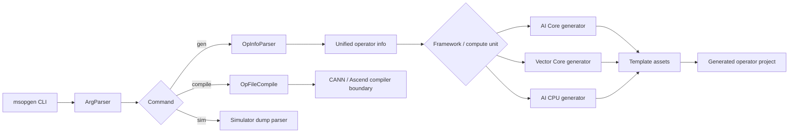
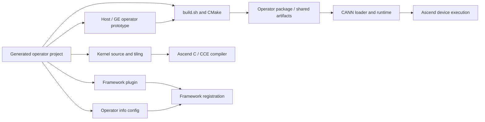
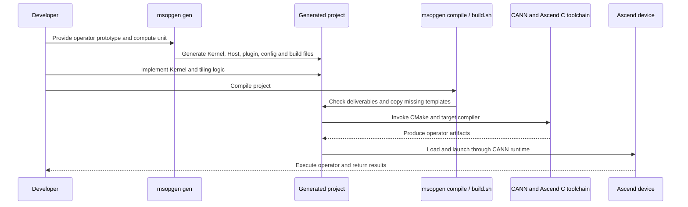

| Field | Value |
|:---|:---|
| Source | [Ascend/msopgen](https://gitcode.com/Ascend/msopgen) |
| Version | [tag_MindStudio_26.2.0.B060_001](https://gitcode.com/Ascend/msopgen/tree/tag_MindStudio_26.2.0.B060_001) |
| Commit | [dd96cdfb2768a89a063db4cee7c760d2c9c4870a](https://gitcode.com/Ascend/msopgen/commit/dd96cdfb2768a89a063db4cee7c760d2c9c4870a) |
| Date | 2026-09-08 |

# CANN msopgen 工程架构：从算子原型到可编译工程的生成链路

## 项目方向概览

[msopgen](https://gitcode.com/Ascend/msopgen) 是 CANN 体系中的 MindStudio Operator Generator，负责把算子原型描述和目标计算单元转换为可继续开发、编译和交付的自定义算子工程。它的命令入口支持三类职责：`gen` 生成或扩展算子工程，`compile` 编译已有算子工程，`sim` 解析模拟器流水线 dump 数据；三类命令由 [`msopgen/msopgen.py`](https://gitcode.com/Ascend/msopgen/blob/dd96cdfb2768a89a063db4cee7c760d2c9c4870a/msopgen/msopgen.py) 统一分发。

msopgen 的核心不是一个算子编译器后端，而是一个**工程生成器和交付前置层**：它读取 JSON、Excel 或框架相关的算子信息，建立统一的算子描述对象，依据框架、计算单元和语言选择工程模板，再生成 Host、Kernel、配置、构建文件及配套目录。真正的 Ascend C/CANN 编译由生成工程中的构建链继续完成。

## 工程结构

msopgen 的代码按“命令控制层 → 输入描述解析层 → 工程类型选择层 → 模板渲染层 → 编译/模拟辅助层”组织。生成器本身不负责重新实现 Ascend C 编译器，而是把算子原型映射为一套与 CANN 工具链约定一致的工程文件。

| Layer | Implementation | Role |
|:---|:---|:---|
| CLI 入口 | [`msopgen/msopgen.py`](https://gitcode.com/Ascend/msopgen/blob/dd96cdfb2768a89a063db4cee7c760d2c9c4870a/msopgen/msopgen.py) | 统一处理 `gen`、`compile`、`sim` 命令 |
| 参数与命令模型 | [`msopgen/interface/arg_parser.py`](https://gitcode.com/Ascend/msopgen/blob/dd96cdfb2768a89a063db4cee7c760d2c9c4870a/msopgen/interface/arg_parser.py) | 校验输入文件、框架、计算单元、语言、输出路径和编译参数 |
| 算子信息解析 | [`msopgen/interface/op_info_parser.py`](https://gitcode.com/Ascend/msopgen/blob/dd96cdfb2768a89a063db4cee7c760d2c9c4870a/msopgen/interface/op_info_parser.py) | 按 JSON/Excel、TensorFlow/IR、MindSpore 等输入类型选择解析器 |
| 输入对象模型 | [`msopgen/interface/op_info_ir_json.py`](https://gitcode.com/Ascend/msopgen/blob/dd96cdfb2768a89a063db4cee7c760d2c9c4870a/msopgen/interface/op_info_ir_json.py)、[`op_info_ir.py`](https://gitcode.com/Ascend/msopgen/blob/dd96cdfb2768a89a063db4cee7c760d2c9c4870a/msopgen/interface/op_info_ir.py) | 将原型字段转换为生成阶段使用的统一算子信息 |
| 工程类型选择 | [`msopgen/interface/op_file_generator.py`](https://gitcode.com/Ascend/msopgen/blob/dd96cdfb2768a89a063db4cee7c760d2c9c4870a/msopgen/interface/op_file_generator.py) | 按框架和 AI Core、Vector Core、AI CPU 选择工程生成器 |
| 工程生成器 | [`msopgen/interface/op_file_aicore.py`](https://gitcode.com/Ascend/msopgen/blob/dd96cdfb2768a89a063db4cee7c760d2c9c4870a/msopgen/interface/op_file_aicore.py)、[`op_file_aicpu.py`](https://gitcode.com/Ascend/msopgen/blob/dd96cdfb2768a89a063db4cee7c760d2c9c4870a/msopgen/interface/op_file_aicpu.py)、[`op_file_vectorcore.py`](https://gitcode.com/Ascend/msopgen/blob/dd96cdfb2768a89a063db4cee7c760d2c9c4870a/msopgen/interface/op_file_vectorcore.py) | 为不同执行单元生成对应工程文件 |
| 模板资产 | [`msopgen/new_op_project_template/`](https://gitcode.com/Ascend/msopgen/tree/dd96cdfb2768a89a063db4cee7c760d2c9c4870a/msopgen/new_op_project_template)、[`msopgen/json_template/`](https://gitcode.com/Ascend/msopgen/tree/dd96cdfb2768a89a063db4cee7c760d2c9c4870a/msopgen/json_template) | 保存工程骨架、输入样例和生成所需资产 |
| 工程打包 | [`setup.py`](https://gitcode.com/Ascend/msopgen/blob/dd96cdfb2768a89a063db4cee7c760d2c9c4870a/setup.py) | 生成可执行 `msopgen`、打包模板并记录主仓与 `asc-tools` revision |
| 编译辅助 | [`msopgen/interface/op_file_compile.py`](https://gitcode.com/Ascend/msopgen/blob/dd96cdfb2768a89a063db4cee7c760d2c9c4870a/msopgen/interface/op_file_compile.py) | 对已生成的算子工程进行后续编译衔接 |
| 模拟器辅助 | [`msopgen/simulator/`](https://gitcode.com/Ascend/msopgen/tree/dd96cdfb2768a89a063db4cee7c760d2c9c4870a/msopgen/simulator) | 解析流水线、指令和寄存器 dump，形成 trace/统计信息 |

### 命令控制层

[`_msopgen_task()`](https://gitcode.com/Ascend/msopgen/blob/dd96cdfb2768a89a063db4cee7c760d2c9c4870a/msopgen/msopgen.py#L47-L60) 先创建 [`ArgParser`](https://gitcode.com/Ascend/msopgen/blob/dd96cdfb2768a89a063db4cee7c760d2c9c4870a/msopgen/interface/arg_parser.py#L86-L151)，再根据命令标志选择 `OpFileGenerator`、`OpFileCompile` 或 `Simulator`。这使生成、编译和 dump 解析共享同一个 CLI 参数和错误处理边界，但三者的业务实现保持分离。

### 算子描述解析层

[`OpInfoParser`](https://gitcode.com/Ascend/msopgen/blob/dd96cdfb2768a89a063db4cee7c760d2c9c4870a/msopgen/interface/op_info_parser.py#L35-L66) 根据后缀和框架选择不同解析器：JSON 走 [`JsonIROpInfo`](https://gitcode.com/Ascend/msopgen/blob/dd96cdfb2768a89a063db4cee7c760d2c9c4870a/msopgen/interface/op_info_ir_json.py)，Excel 走 IR/TF 对应解析器，MindSpore 则进入独立的 MindSpore 输入模型。解析器先调用 `parse()`，将外部原型字段整理成后续模板能够消费的对象。

这一层是 msopgen 的协议适配核心：输入描述可以来自不同框架和格式，但生成器后面不需要为每一种输入格式重新实现文件生成逻辑。

### 工程类型选择层

[`OpFileGenerator._create_op_file()`](https://gitcode.com/Ascend/msopgen/blob/dd96cdfb2768a89a063db4cee7c760d2c9c4870a/msopgen/interface/op_file_generator.py#L40-L62) 先判断 MindSpore 框架，再依据 `core_type` 分派到 AI Core、Vector Core 或 AI CPU 工程生成器。生成器只负责选择和调度，具体文件组织由各 [`OpFile*`](https://gitcode.com/Ascend/msopgen/tree/dd96cdfb2768a89a063db4cee7c760d2c9c4870a/msopgen/interface) 实现完成。

这意味着“输入格式”和“目标执行单元”是两个独立的变化轴：同一种算子描述可以进入不同计算单元工程，不同输入格式也可以汇聚到同一种目标工程。

### 模板和打包层

[`setup.py`](https://gitcode.com/Ascend/msopgen/blob/dd96cdfb2768a89a063db4cee7c760d2c9c4870a/setup.py#L31-L64) 在安装阶段复制 `msopgen/msopgen.py` 生成可执行入口，并将 `thirdparty/asc-tools/utils/templates/new_op_project_template` 链接到 `msopgen/new_op_project_template`。这说明当前工程把 Ascend C 新算子工程模板作为独立资产供给，而不是把所有模板内容永久复制在 msopgen 主代码中。

同一文件中的 [`write_build_info()`](https://gitcode.com/Ascend/msopgen/blob/dd96cdfb2768a89a063db4cee7c760d2c9c4870a/setup.py#L95-L107) 同时记录主仓和 `asc-tools` 的 Git revision，形成“生成器版本 + 模板依赖版本”的双重追踪边界。

## 项目核心竞争点

### 1. 将算子原型转换为完整工程，而不是只生成代码片段

msopgen 输出的是可继续开发的算子工程，包含 Host、Kernel、配置、构建和打包所需的工程骨架。入口参数中的 `-i`、`-c`、`-lan` 和 `-out` 分别表达输入原型、目标计算单元、开发语言和输出目录，参数定义位于 [`arg_parser.py`](https://gitcode.com/Ascend/msopgen/blob/dd96cdfb2768a89a063db4cee7c760d2c9c4870a/msopgen/interface/arg_parser.py#L193-L230)。

### 2. 输入协议与目标工程解耦

JSON、Excel、TensorFlow、IR 和 MindSpore 输入通过不同的 [`OpInfo`](https://gitcode.com/Ascend/msopgen/tree/dd96cdfb2768a89a063db4cee7c760d2c9c4870a/msopgen/interface) 实现接入，再汇聚到工程生成器。这样变化被限制在“输入解析器”或“目标工程生成器”一侧，不需要让 CLI 和模板层同时感知所有输入组合。

### 3. 将框架、计算单元和模板版本纳入生成决策

工程类型不是固定模板复制，而是由框架和计算单元共同决定。[`OpFileGenerator`](https://gitcode.com/Ascend/msopgen/blob/dd96cdfb2768a89a063db4cee7c760d2c9c4870a/msopgen/interface/op_file_generator.py) 对 MindSpore AI Core、MindSpore AI CPU、通用 AI Core、Vector Core 和 AI CPU 进行分派；安装脚本则通过 `asc-tools` 模板链接和 revision 记录处理模板演进。

### 4. 将生成、编译和流水线分析放在同一个工具入口

`gen` 面向工程创建，`compile` 面向生成工程的后续构建，`sim` 面向模拟器数据解析。三条路径由 [`msopgen.py`](https://gitcode.com/Ascend/msopgen/blob/dd96cdfb2768a89a063db4cee7c760d2c9c4870a/msopgen/msopgen.py) 统一承接，使算子开发工具从“项目脚手架”延伸到编译交付和底层流水线信息分析。

## 技术边界与工程定位

msopgen 是 CANN 体系中具有明确职责边界的自研工程生成器，不存在一个能够完整对应其“算子原型适配 + 计算单元分派 + 模板装配 + CANN 工程交付”链路的通用同类项目。因此本文不强行进行横向产品比较，而是说明它自身的不可替代性。

它的核心边界是把结构化算子描述转换成可继续开发的 Host、Kernel、配置和构建工程；它不重新实现 Ascend C 编译器，也不取代 CANN 的目标编译和运行时。这个边界由 [`msopgen/msopgen.py`](https://gitcode.com/Ascend/msopgen/blob/dd96cdfb2768a89a063db4cee7c760d2c9c4870a/msopgen/msopgen.py)、[`OpInfoParser`](https://gitcode.com/Ascend/msopgen/blob/dd96cdfb2768a89a063db4cee7c760d2c9c4870a/msopgen/interface/op_info_parser.py) 和 [`OpFileGenerator`](https://gitcode.com/Ascend/msopgen/blob/dd96cdfb2768a89a063db4cee7c760d2c9c4870a/msopgen/interface/op_file_generator.py) 分别落在命令、输入协议和工程生成三个层次。

msopgen 的独特性来自它把 CANN 算子开发中的隐含工程约定显式化：输入格式、框架类型、目标计算单元、模板版本和生成结果被串成一个可追踪的生产链路。尤其是 [`setup.py`](https://gitcode.com/Ascend/msopgen/blob/dd96cdfb2768a89a063db4cee7c760d2c9c4870a/setup.py) 同时记录主仓与 `asc-tools` 模板依赖 revision，使生成器逻辑和工程模板能够独立演进但仍可追溯。
## 生成工程的编译与运行结构

msopgen 生成的不是停留在源码层面的目录骨架，而是一个需要继续交给 CANN/Ascend C 工具链编译和装载的算子交付工程。以 AI Core C++ 路径为例，生成器在 [`OPFile._generate_project()`](https://gitcode.com/Ascend/msopgen/blob/dd96cdfb2768a89a063db4cee7c760d2c9c4870a/msopgen/interface/op_file.py#L117-L158) 中复制 Ascend C 模板，再由 [`_new_operator()`](https://gitcode.com/Ascend/msopgen/blob/dd96cdfb2768a89a063db4cee7c760d2c9c4870a/msopgen/interface/op_file.py#L160-L164) 依次生成实现、框架插件、算子信息配置和算子原型。

| Generated layer | Evidence | Runtime/build role |
|:---|:---|:---|
| Kernel source | [`OpFileAiCore._generate_cpp_impl()`](https://gitcode.com/Ascend/msopgen/blob/dd96cdfb2768a89a063db4cee7c760d2c9c4870a/msopgen/interface/op_file_aicore.py#L132-L163) | 生成 `kernel_operator.h`、tiling 头文件和 `__aicore__` Kernel 入口 |
| Tiling data | [`REGISTER_TILING_DEFAULT` / `GET_TILING_DATA`](https://gitcode.com/Ascend/msopgen/blob/dd96cdfb2768a89a063db4cee7c760d2c9c4870a/msopgen/interface/op_file_aicore.py#L139-L158) | Kernel 从 Host 传入的 tiling buffer 读取运行参数 |
| Host/operator metadata | [`OPTmpl.IR_H_HEAD`](https://gitcode.com/Ascend/msopgen/blob/dd96cdfb2768a89a063db4cee7c760d2c9c4870a/msopgen/interface/op_tmpl.py#L55-L92) | 生成 GE/算子原型声明、输入输出和属性描述 |
| Framework plugin | [`_generate_plugin()`](https://gitcode.com/Ascend/msopgen/blob/dd96cdfb2768a89a063db4cee7c760d2c9c4870a/msopgen/interface/op_file.py#L166-L180) | 为 TensorFlow、ONNX、Caffe 等框架生成注册和参数解析边界 |
| Operator info config | [`generate_info_cfg()`](https://gitcode.com/Ascend/msopgen/blob/dd96cdfb2768a89a063db4cee7c760d2c9c4870a/msopgen/interface/op_file_aicore.py#L102-L130) | 生成输入输出、属性、二进制文件和接口名配置 |
| Build template | [`OpFileCompile.compile()`](https://gitcode.com/Ascend/msopgen/blob/dd96cdfb2768a89a063db4cee7c760d2c9c4870a/msopgen/interface/op_file_compile.py#L87-L108) | 检查交付目录、补齐模板、替换 CANN 路径并执行 `build.sh` |
| Target artifacts | [`_copy_deliverable_cmake_file()`](https://gitcode.com/Ascend/msopgen/blob/dd96cdfb2768a89a063db4cee7c760d2c9c4870a/msopgen/interface/op_file_compile.py#L165-L191) | 为 TBE、AI CPU 和 framework plugin 目录补充 CMake 文件 |

编译运行边界可以概括为：`msopgen gen` 只负责创建和填充工程；`msopgen compile` 负责检查工程交付物、从 CANN 安装目录复制缺失模板并执行工程内的 [`build.sh`](https://gitcode.com/Ascend/msopgen/blob/dd96cdfb2768a89a063db4cee7c760d2c9c4870a/msopgen/interface/op_file_compile.py#L87-L108)；随后由生成工程的 CMake、Ascend C/CCE 编译器、CANN 库和运行时完成目标产物生成、加载与设备执行。msopgen 本身不承担 Kernel 内部调度优化，也不替代 CANN 运行时。

## 复用的公共组件

这里有价值的复用主要是**模板协议和工具链资产的工程化复用**，不是 Python、CANN 或 setuptools 这些普通底座依赖。

| Reused component | Reuse boundary | Analysis value |
|:---|:---|:---|
| `asc-tools` 的新算子工程模板 | [`setup.py`](https://gitcode.com/Ascend/msopgen/blob/dd96cdfb2768a89a063db4cee7c760d2c9c4870a/setup.py#L56-L63) 将模板链接到 msopgen 安装目录 | 将模板生命周期从生成器代码中拆出，并支持模板独立演进 |
| 算子原型输入协议 | JSON/Excel/框架解析器共同汇聚到 [`OpInfo`](https://gitcode.com/Ascend/msopgen/tree/dd96cdfb2768a89a063db4cee7c760d2c9c4870a/msopgen/interface) | 多种框架输入复用同一生成后端 |
| CANN 自定义算子工程约定 | 由 [`new_op_project_template`](https://gitcode.com/Ascend/msopgen/tree/dd96cdfb2768a89a063db4cee7c760d2c9c4870a/msopgen/new_op_project_template) 和 compile 路径共同承接 | 生成器和外部编译工具之间形成稳定交付接口 |
| `asc-tools` revision 元数据 | [`write_build_info()`](https://gitcode.com/Ascend/msopgen/blob/dd96cdfb2768a89a063db4cee7c760d2c9c4870a/setup.py#L95-L107) 同时记录两个仓库版本 | 解决生成器与模板版本不一致时的追踪问题 |

普通的 Python、CANN、CMake、setuptools 和模板引擎依赖只构成运行或打包背景，不单独说明 msopgen 的竞争力。

## 可复用但自行开发的部分及原因

### 1. 自行维护多输入格式的 OpInfo 适配层

msopgen 没有要求所有上层框架先把输入转换为单一外部工具格式，而是在 [`op_info_parser.py`](https://gitcode.com/Ascend/msopgen/blob/dd96cdfb2768a89a063db4cee7c760d2c9c4870a/msopgen/interface/op_info_parser.py) 中维护 JSON、Excel、TensorFlow、IR 和 MindSpore 的解析分支。原因是算子原型中的字段、属性和框架语义并不完全相同，输入适配必须在进入模板之前完成。

### 2. 自行维护按计算单元分派的工程生成器

AI Core、Vector Core、AI CPU 和 MindSpore 专用工程分别由 [`op_file_aicore.py`](https://gitcode.com/Ascend/msopgen/blob/dd96cdfb2768a89a063db4cee7c760d2c9c4870a/msopgen/interface/op_file_aicore.py)、[`op_file_vectorcore.py`](https://gitcode.com/Ascend/msopgen/blob/dd96cdfb2768a89a063db4cee7c760d2c9c4870a/msopgen/interface/op_file_vectorcore.py) 等模块承接。原因是不同计算单元的 Kernel、Host、配置和构建边界不同，无法只靠通用文本替换得到稳定工程。

### 3. 自行维护模板版本绑定和构建元数据

[`setup.py`](https://gitcode.com/Ascend/msopgen/blob/dd96cdfb2768a89a063db4cee7c760d2c9c4870a/setup.py) 没有只依赖包版本，而是生成 `_build_info.py`，记录 msopgen 主仓与 `asc-tools` 的 revision。原因是生成结果同时由生成器逻辑和模板资产决定，只有记录两者才能追溯实际工程来源。

### 4. 自行维护模拟器 dump 分析链

[`msopgen/simulator/`](https://gitcode.com/Ascend/msopgen/tree/dd96cdfb2768a89a063db4cee7c760d2c9c4870a/msopgen/simulator) 包含指令、寄存器、I-cache、trace 和统计相关解析模块。它不是普通的日志打印，而是针对 Ascend 算子流水线数据建立独立的解析对象和统计路径，因此被保留在同一 CLI 体系中。

## 已做的发展方向

从当前源码、版本信息和提交历史可以看到，msopgen 已经完成了从单一算子工程生成脚本到多输入、多计算单元和多工具链资产管理的扩展。

| Direction | Evidence |
|:---|:---|
| 工程生成 CLI 化 | [`msopgen.py`](https://gitcode.com/Ascend/msopgen/blob/dd96cdfb2768a89a063db4cee7c760d2c9c4870a/msopgen/msopgen.py) 统一提供 `gen`、`compile` 和 `sim` |
| JSON 输入优先 | [`op_info_parser.py`](https://gitcode.com/Ascend/msopgen/blob/dd96cdfb2768a89a063db4cee7c760d2c9c4870a/msopgen/interface/op_info_parser.py) 保留 Excel 兼容，同时把 JSON 作为独立主路径 |
| Ascend C 新工程适配 | 提交 [`6d0ce11`](https://gitcode.com/Ascend/msopgen/commit/6d0ce11) 的主题为适配 Ascend C 新工程 |
| 模板外置到 asc-tools | [`setup.py`](https://gitcode.com/Ascend/msopgen/blob/dd96cdfb2768a89a063db4cee7c760d2c9c4870a/setup.py#L56-L63) 通过 `thirdparty/asc-tools` 提供模板 |
| 版本可追溯 | [`write_build_info()`](https://gitcode.com/Ascend/msopgen/blob/dd96cdfb2768a89a063db4cee7c760d2c9c4870a/setup.py#L95-L107) 记录生成器和模板依赖 revision |
| 多计算单元支持 | [`OpFileGenerator`](https://gitcode.com/Ascend/msopgen/blob/dd96cdfb2768a89a063db4cee7c760d2c9c4870a/msopgen/interface/op_file_generator.py) 已显式分派 AI Core、Vector Core 和 AI CPU |

## 正在做的发展方向

当前代码和提交历史显示，项目仍在围绕模板、计算单元和框架适配继续扩展：

| Direction | Evidence |
|:---|:---|
| 新 Ascend C 工程模板持续适配 | [`6d0ce11`](https://gitcode.com/Ascend/msopgen/commit/6d0ce11) 与模板外置逻辑共同表明模板边界仍在演进 |
| 新 SoC 类型适配 | 提交 [`d1813e5`](https://gitcode.com/Ascend/msopgen/commit/d1813e5) 的主题为修改部分 SoC 类型 |
| 生成器与模板独立发布 | `asc-tools` 子模块和 [主仓/依赖双 revision](https://gitcode.com/Ascend/msopgen/blob/dd96cdfb2768a89a063db4cee7c760d2c9c4870a/setup.py#L95-L107) 为模板独立演进保留空间 |
| 框架工程类型扩展 | [`op_file_mindspore_aicore.py`](https://gitcode.com/Ascend/msopgen/blob/dd96cdfb2768a89a063db4cee7c760d2c9c4870a/msopgen/interface/op_file_mindspore_aicore.py) 和 [`op_file_mindspore_aicpu.py`](https://gitcode.com/Ascend/msopgen/blob/dd96cdfb2768a89a063db4cee7c760d2c9c4870a/msopgen/interface/op_file_mindspore_aicpu.py) 表明框架专用工程仍在维护 |
| 生成后编译和模拟分析联动 | [`op_file_compile.py`](https://gitcode.com/Ascend/msopgen/blob/dd96cdfb2768a89a063db4cee7c760d2c9c4870a/msopgen/interface/op_file_compile.py) 与 [`simulator/`](https://gitcode.com/Ascend/msopgen/tree/dd96cdfb2768a89a063db4cee7c760d2c9c4870a/msopgen/simulator) 继续共存于统一入口 |

## 生成链路中的边界

msopgen 的责任边界可以明确分成三段：

| Stage | msopgen responsibility | External boundary |
|:---|:---|:---|
| 原型到内部对象 | 参数解析、格式识别、框架适配和算子信息整理 | 输入 JSON/Excel 或框架原型 |
| 内部对象到工程 | 计算单元分派、模板选择、目录和文件生成、构建元数据记录 | Ascend C/CANN 工程模板 |
| 工程到目标产物 | 触发或衔接生成工程的编译流程 | CANN、Ascend C 编译工具链和目标设备 |

因此，msopgen 不是 Ascend C Kernel 的优化器，也不是 CANN 编译器本身。它的工程价值在于把上层算子描述、目标执行单元和 CANN 交付工程之间的接口固定下来，并把模板、版本和生成结果组织成可追踪的工程产物。
