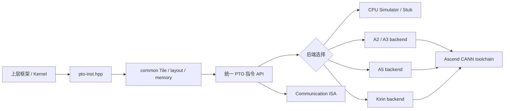
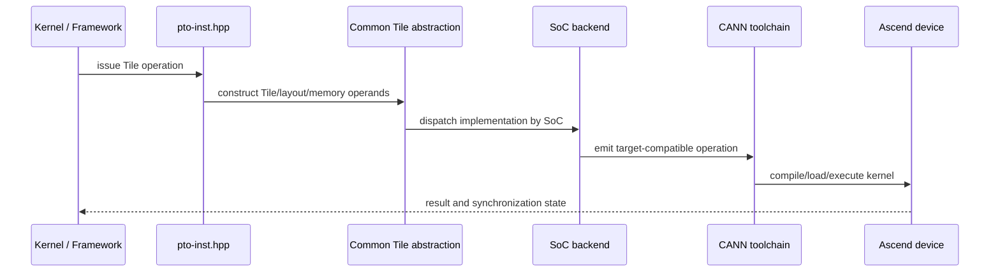

| Field | Value |
|:---|:---|
| Source | [cann/pto-isa](https://gitcode.com/cann/pto-isa) |
| Version | [v9.2.0-beta.2-106-ga5c8d608](https://gitcode.com/cann/pto-isa/commit/a5c8d60850a531593dcd633b308d11d39db6363b) |
| Commit | [a5c8d60850a531593dcd633b308d11d39db6363b](https://gitcode.com/cann/pto-isa/commit/a5c8d60850a531593dcd633b308d11d39db6363b) |
| Date | 2026-09-08 |

# PTO-ISA：面向昇腾 Tile 编程的虚拟指令集与实现体系

## 项目方向概览

[PTO（Parallel Tile Operation）](https://gitcode.com/cann/pto-isa/blob/a5c8d60850a531593dcd633b308d11d39db6363b/README_zh.md) 是昇腾 CANN 体系中的 Tile 编程虚拟 ISA。仓库提供以 C/C++ 头文件为核心的 PTO Tile Library、按昇腾代际划分的后端实现、CPU 语义仿真/Stub、通信指令扩展、算子示例和 ISA 文档。

它解决的主要问题不是再封装一层普通算子 API，而是把算子开发中的 Tile 形状、有效区域、数据搬运、片上存储、事件同步、流水线和硬件指令映射，收敛为一个可以跨 Ascend A2/A3/A5 等代际复用的编程契约。上层框架或算子实现面向 PTO 指令组织代码，底层再按 SoC 选择不同实现。

官方文档将 PTO 定位为面向 tile 的虚拟 ISA，目前覆盖计算、数据搬运、同步、量化、卷积、矩阵和通信等指令族，并已被 [PyPTO](https://gitcode.com/cann/pypto)、[TileLang Ascend](https://github.com/tile-ai/tilelang-ascend) 等上层项目集成。

<!-- more -->

## 工程结构

PTO-ISA 的工程结构是“公共指令契约 + 后端实现 + kernel 示例 + 文档/工具链”的分层，而不是一个单一的硬件指令头文件集合。

| Layer | Implementation | Role |
|:---|:---|:---|
| ISA 文档与契约 | [`docs/isa/`](https://gitcode.com/cann/pto-isa/tree/a5c8d60850a531593dcd633b308d11d39db6363b/docs/isa) | 定义指令分类、操作数、约束和语义边界 |
| 编程模型 | [`docs/coding/Tile_zh.md`](https://gitcode.com/cann/pto-isa/blob/a5c8d60850a531593dcd633b308d11d39db6363b/docs/coding/Tile_zh.md)、[`Event_zh.md`](https://gitcode.com/cann/pto-isa/blob/a5c8d60850a531593dcd633b308d11d39db6363b/docs/coding/Event_zh.md) | 说明 Tile shape、mask、布局、事件和流水线组织 |
| 统一入口 | [`include/pto/pto-inst.hpp`](https://gitcode.com/cann/pto-isa/blob/a5c8d60850a531593dcd633b308d11d39db6363b/include/pto/pto-inst.hpp) | 根据构建配置选择 CPU 或 NPU 实现 |
| 公共抽象 | [`include/pto/common/`](https://gitcode.com/cann/pto-isa/tree/a5c8d60850a531593dcd633b308d11d39db6363b/include/pto/common) | Tile 类型、布局、内存视图、指令声明和共享工具 |
| CPU 后端 | [`include/pto/cpu/`](https://gitcode.com/cann/pto-isa/tree/a5c8d60850a531593dcd633b308d11d39db6363b/include/pto/cpu) | 在 CPU 上提供指令语义仿真和开发调试路径 |
| NPU 后端 | [`include/pto/npu/`](https://gitcode.com/cann/pto-isa/tree/a5c8d60850a531593dcd633b308d11d39db6363b/include/pto/npu) | 按 A2/A3、A5、Kirin 等 SoC 代际组织实现 |
| 通信扩展 | [`include/pto/comm/`](https://gitcode.com/cann/pto-isa/tree/a5c8d60850a531593dcd633b308d11d39db6363b/include/pto/comm)、[`docs/isa/comm/`](https://gitcode.com/cann/pto-isa/tree/a5c8d60850a531593dcd633b308d11d39db6363b/docs/isa/comm) | 提供点对点、信号同步和集合通信抽象 |
| Kernel 与示例 | [`kernels/`](https://gitcode.com/cann/pto-isa/tree/a5c8d60850a531593dcd633b308d11d39db6363b/kernels)、[`demos/`](https://gitcode.com/cann/pto-isa/tree/a5c8d60850a531593dcd633b308d11d39db6363b/demos) | 展示手工优化、Auto Mode、PyTorch/JIT 和通信融合用法 |
| 构建与发布 | [`CMakeLists.txt`](https://gitcode.com/cann/pto-isa/blob/a5c8d60850a531593dcd633b308d11d39db6363b/CMakeLists.txt)、[`cmake/`](https://gitcode.com/cann/pto-isa/tree/a5c8d60850a531593dcd633b308d11d39db6363b/cmake)、[`scripts/`](https://gitcode.com/cann/pto-isa/tree/a5c8d60850a531593dcd633b308d11d39db6363b/scripts) | 负责多后端构建、打包和文档工程装配 |

`include/pto/README_zh.md` 明确说明，A2/A3 共用 [`include/pto/npu/a2a3/`](https://gitcode.com/cann/pto-isa/tree/a5c8d60850a531593dcd633b308d11d39db6363b/include/pto/npu/a2a3)，A5 使用 [`include/pto/npu/a5/`](https://gitcode.com/cann/pto-isa/tree/a5c8d60850a531593dcd633b308d11d39db6363b/include/pto/npu/a5)，统一入口根据构建宏选择相应实现。这种目录和头文件组织使上层 kernel 的指令组织方式保持稳定，而把硬件代际差异集中在后端实现中。

## 项目核心竞争点

### 1. 用 Tile 级契约连接可移植性和性能控制

PTO 的抽象对象不是只带形状的普通 Tensor，而是带有 Tile shape、有效区域、布局、位置意图和流水线关系的硬件感知对象。[Tile 编程模型](https://gitcode.com/cann/pto-isa/blob/a5c8d60850a531593dcd633b308d11d39db6363b/docs/coding/Tile_zh.md) 将静态 Tile shape、动态 mask 和数据组织方式纳入编程模型，使上层代码可以表达搬运、计算和片上缓冲之间的关系。

### 2. Auto / Manual 双模式

仓库同时提供 [Auto Mode 示例](https://gitcode.com/cann/pto-isa/tree/a5c8d60850a531593dcd633b308d11d39db6363b/demos/auto_mode) 和 [Manual kernel 示例](https://gitcode.com/cann/pto-isa/tree/a5c8d60850a531593dcd633b308d11d39db6363b/kernels/manual)。Auto 路径适合快速组织 Tile 操作和验证编程模型，Manual 路径则保留显式 Tile buffer、事件、双缓冲、流水线和指令顺序控制。两者共享 PTO 指令契约，而不是维护两套互不兼容的算子接口。

### 3. 把通信纳入 Tile ISA

除计算和搬运外，[通信 ISA](https://gitcode.com/cann/pto-isa/tree/a5c8d60850a531593dcd633b308d11d39db6363b/docs/isa/comm) 提供 `TGET`、`TPUT`、异步通信、信号和集合通信等原语。仓库中的 [GEMM AllReduce 示例](https://gitcode.com/cann/pto-isa/tree/a5c8d60850a531593dcd633b308d11d39db6363b/kernels/manual/a2a3/gemm_ar) 体现了计算与通信在同一 kernel 流水线中的组合方式，重点从单算子优化扩展到通算融合。

### 4. 语义仿真、硬件实现和性能模型共享一个接口层

[CPU 后端](https://gitcode.com/cann/pto-isa/tree/a5c8d60850a531593dcd633b308d11d39db6363b/include/pto/cpu) 让同一套 PTO 调用可以在非 NPU 环境中进行语义开发；NPU 后端按 SoC 分层实现；仓库还包含 [CostModel 相关目录](https://gitcode.com/cann/pto-isa/tree/a5c8d60850a531593dcd633b308d11d39db6363b/include/pto/costmodel)。这使指令契约同时服务于算法表达、功能仿真、硬件实现和性能建模。

## 相比同类产品的实现差异

与直接面向某一代硬件的 intrinsic 或单个算子库相比，PTO-ISA 的差异在于把跨代迁移边界前移到虚拟 ISA：上层代码围绕标准 PTO 操作描述 Tile 计算，A2/A3、A5 和其他后端负责把同一操作映射到不同硬件实现。

与只提供高层 Tensor API 的框架相比，PTO 保留了 Tile shape、mask、内存层级、事件同步、固定功能单元和流水线等底层控制点；与完全手写硬件 intrinsic 相比，它通过 [`common`](https://gitcode.com/cann/pto-isa/tree/a5c8d60850a531593dcd633b308d11d39db6363b/include/pto/common) 层和统一入口减少跨代代码分叉。

与只覆盖计算指令的 Tile 抽象相比，PTO 把通信单元也纳入相同的指令体系，并在 [`include/pto/comm/`](https://gitcode.com/cann/pto-isa/tree/a5c8d60850a531593dcd633b308d11d39db6363b/include/pto/comm) 中建立独立但一致的通信入口，使 `TGET_ASYNC`、`TPUT_ASYNC`、通知/等待和集合通信能够与计算流水线组合。

## 复用的公共组件

这里有分析价值的“复用”不是 CANN、CMake 或 C++ 标准库等普通底座，而是 PTO 自身定义的跨层公共契约被多个上层和后端共同复用。

| Reused component | Reuse boundary | Why it matters |
|:---|:---|:---|
| PTO Tile/ISA API | PyPTO、TileLang Ascend、手工 kernel 和示例共同面向 [标准指令文档](https://gitcode.com/cann/pto-isa/tree/a5c8d60850a531593dcd633b308d11d39db6363b/docs/isa) | 上层框架不必为每代硬件重新定义 Tile 操作语义 |
| Common Tile/layout/memory abstraction | [公共头文件层](https://gitcode.com/cann/pto-isa/tree/a5c8d60850a531593dcd633b308d11d39db6363b/include/pto/common) 被 CPU、NPU 和通信实现共享 | 把数据模型与 SoC 指令映射解耦 |
| Event/synchronization contract | [事件编程模型](https://gitcode.com/cann/pto-isa/blob/a5c8d60850a531593dcd633b308d11d39db6363b/docs/coding/Event_zh.md) 与通信 `TNOTIFY`/`TWAIT` 等指令共同使用 | 计算流水线和通信流水线可以使用一致的顺序表达 |
| Communication ISA | [通信指令入口](https://gitcode.com/cann/pto-isa/blob/a5c8d60850a531593dcd633b308d11d39db6363b/include/pto/comm/pto_comm_inst.hpp) 被通信 kernel 和通算融合示例复用 | 将跨 NPU 数据传输纳入 Tile 级优化边界 |

普通的 CANN、Python、CMake、C++ 标准库和工具链依赖只构成运行或构建背景，不能说明 PTO-ISA 的核心技术差异。

## 可复用但自行开发的部分及原因

### 1. 自行维护按 SoC 划分的 NPU 后端

PTO 没有把所有硬件差异交给上层框架处理，而是在 [`npu/a2a3`](https://gitcode.com/cann/pto-isa/tree/a5c8d60850a531593dcd633b308d11d39db6363b/include/pto/npu/a2a3)、[`npu/a5`](https://gitcode.com/cann/pto-isa/tree/a5c8d60850a531593dcd633b308d11d39db6363b/include/pto/npu/a5) 和 [`npu/kirin9030`](https://gitcode.com/cann/pto-isa/tree/a5c8d60850a531593dcd633b308d11d39db6363b/include/pto/npu/kirin9030) 中自行完成模板参数、流水线和指令映射。原因是不同代际的硬件能力、布局约束和流水线行为不能仅靠公共 API 自动抹平；差异必须保留在靠近硬件的实现层。

### 2. 自行开发 CPU Simulator / Stub

CPU 路径不是直接复用某个通用 GPU 仿真器，而是围绕 PTO 的 Tile 和同步语义建立 [CPU 支持](https://gitcode.com/cann/pto-isa/tree/a5c8d60850a531593dcd633b308d11d39db6363b/include/pto/cpu)。这样做的原因是 CPU 路径需要解释 PTO 自己的 Tile shape、mask、数据搬运和事件行为，并保持与 NPU 入口相同的 C++ 调用形式。

### 3. 自行开发通信指令层

通信功能没有仅依赖上层通信库，而是形成 [PTO 通信类型和指令实现](https://gitcode.com/cann/pto-isa/tree/a5c8d60850a531593dcd633b308d11d39db6363b/include/pto/comm)。原因是点对点传输、异步 DMA、信号同步和集合通信需要进入 Tile kernel 的顺序与流水线模型，普通通信 API 无法表达这些硬件级组合关系。

### 4. 自行开发 CostModel 和 Auto Mode 方向

仓库将 [CostModel](https://gitcode.com/cann/pto-isa/tree/a5c8d60850a531593dcd633b308d11d39db6363b/include/pto/costmodel) 与 [Auto Mode 示例](https://gitcode.com/cann/pto-isa/tree/a5c8d60850a531593dcd633b308d11d39db6363b/demos/auto_mode) 纳入 PTO 生态，而不是把 Tile 选择和流水线代价完全交给外部框架。原因是 Tile shape、搬运路径、同步和硬件流水线之间存在 PTO 特有的代价关系，需要由配套工具链理解 PTO 语义。

## 主要功能时序

从上层 kernel 到后端执行的主链跨越公共 API、后端选择、硬件实现和 CANN 工具链，时序能够说明 PTO 的核心边界：

上层入口由 [`include/pto/pto-inst.hpp`](https://gitcode.com/cann/pto-isa/blob/a5c8d60850a531593dcd633b308d11d39db6363b/include/pto/pto-inst.hpp) 统一，公共 Tile 类型位于 [`include/pto/common/pto_tile.hpp`](https://gitcode.com/cann/pto-isa/blob/a5c8d60850a531593dcd633b308d11d39db6363b/include/pto/common/pto_tile.hpp)，后端按 [`include/pto/npu/`](https://gitcode.com/cann/pto-isa/tree/a5c8d60850a531593dcd633b308d11d39db6363b/include/pto/npu) 选择，最终边界由 CANN 工具链和目标设备承担。

## 已做的发展方向

官方 README 和版本信息显示，PTO-ISA 已从基础 Tile 计算和搬运扩展到更完整的算子与系统能力：

| Direction | Evidence |
|:---|:---|
| 指令族扩展 | README 记录了合轴、MX、卷积、量化和核间通信指令的持续加入，[ISA 索引](https://gitcode.com/cann/pto-isa/tree/a5c8d60850a531593dcd633b308d11d39db6363b/docs/isa) 提供分类入口 |
| 跨代 NPU 支持 | [A2/A3、A5、Kirin 后端目录](https://gitcode.com/cann/pto-isa/tree/a5c8d60850a531593dcd633b308d11d39db6363b/include/pto/npu) 已形成明确分层 |
| 通信扩展 | [点对点、异步、信号和集合通信文档](https://gitcode.com/cann/pto-isa/tree/a5c8d60850a531593dcd633b308d11d39db6363b/docs/isa/comm) 与通信头文件已进入仓库 |
| 上层生态接入 | README 列出 [PyPTO](https://gitcode.com/cann/pypto) 和 [TileLang Ascend](https://github.com/tile-ai/tilelang-ascend) 等集成方向 |
| CPU 与性能工具链 | [CPU 后端](https://gitcode.com/cann/pto-isa/tree/a5c8d60850a531593dcd633b308d11d39db6363b/include/pto/cpu) 和 [CostModel](https://gitcode.com/cann/pto-isa/tree/a5c8d60850a531593dcd633b308d11d39db6363b/include/pto/costmodel) 已作为配套能力出现 |

## 正在做的发展方向

README 的路线表把以下方向列为持续演进或规划中的工作：

| Direction | Documented status |
|:---|:---|
| PTO Auto Mode | 由 BiSheng 编译器自动分配 Tile buffer 并插入同步 |
| PTO Tile Fusion | 由 BiSheng 编译器支持 Tile 操作融合 |
| PTO-AS | PTO ISA 字节码支持 |
| 卷积与量化增强 | 继续扩充卷积、量化、Pooling、Fixpipe 和基础指令能力 |
| 集合通信扩展 | 增加 Ccu、RoCE 异步通信和 AIV 直驱通信指令 |
| 系统调度扩展 | 面向 SPMD/MPMD 编程的调度支持 |
| 微指令 | 允许通过微指令表达高性能算子，并提供基础微指令库 |
| CostModel / CPU-SIM | 随 A5 指令和同步语义继续扩充性能建模与 CPU 侧支持 |

上述方向来自仓库 [README_zh.md 的路线表](https://gitcode.com/cann/pto-isa/blob/a5c8d60850a531593dcd633b308d11d39db6363b/README_zh.md)，其中部分条目仍标注为持续演进、计划中或待补充。

## PTO-ISA 的核心定位

PTO-ISA 的核心价值在于把 Tile 程序的表达边界标准化：上层以统一的 PTO 指令和数据模型描述计算、搬运、布局、同步与通信，后端再承接昇腾不同代际的实现差异。它因此同时成为上层编译器/框架的 kernel 接口、硬件后端的适配边界，以及通算融合和性能建模可以共同使用的 Tile 级契约。
