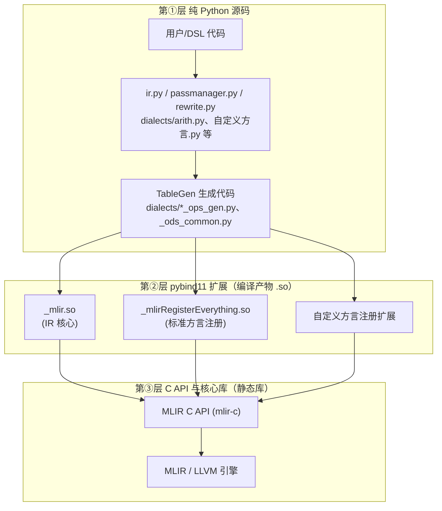
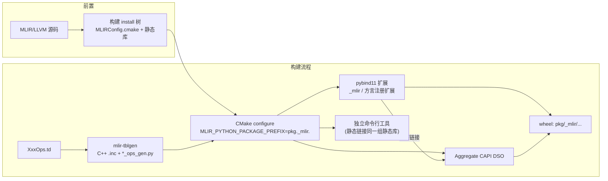
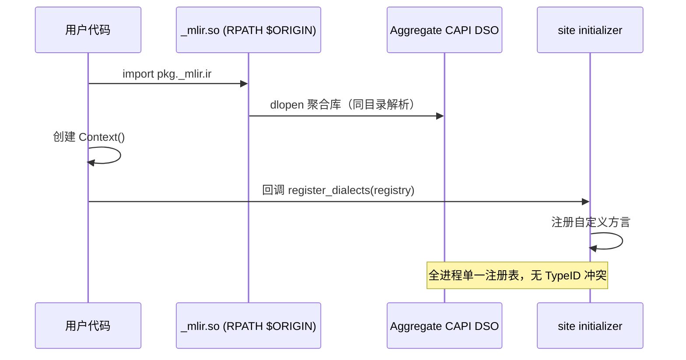

# MLIR Python Bindings 打包机制解析

LLVM 社区没有为 MLIR 的 Python 包提供稳定的发布渠道，任何想在 Python 进程里操作 MLIR IR 的项目都需要自行解决 bindings 的获取、集成与分发。MLIR 官方为此提供了一整套设施：三层架构、CMake 组装宏，以及若干关键机制。

<!-- more -->

---

## 一、问题定义：Python 层操作 IR 意味着什么

在 Python 进程中构造与检查 MLIR IR，典型场景有两类：

- **执行式前端**：DSL 调用 `compile()` 时实际执行用户的 Python 代码，边执行边通过 Python API 增量构造 IR，诊断信息需映射回用户源码行；
- **测试**：直接断言方言 op 与类型。

此外，MLIR Python bindings 并非纯 Python 包，其底层依赖 pybind11 扩展与 C API 静态库。因此「分发」不仅是拷贝 `.py` 文件，而是一项完整的打包工程。

## 二、三层架构

MLIR 的 Python 支持由三层组成，自上而下：

- **第①层**为纯 Python，是面向用户的 API 门面；方言绑定由 TableGen 从 ODS（`.td`）生成，保证 C++ 与 Python 两端语义一致。
- **第②层**为编译出的 pybind11 扩展，承担 Python 对象与 C 指针之间的转换。
- **第③层**为静态库形态的 C API 与引擎本体，是所有语言绑定的共同基础。

三层缺一不可：仅分发第①层 Python 文件无法运行。

## 三、组装设施：AddMLIRPython.cmake

MLIR 源码树里的 `mlir/cmake/modules/AddMLIRPython.cmake` 提供了一整套 CMake 宏，覆盖三层的声明、编译与组装：

| 宏 | 职责 |
| --- | --- |
| `declare_mlir_python_sources` | 声明第①层 Python 源文件（手写 + 生成） |
| `declare_mlir_dialect_python_bindings` | 给定 `XxxOps.td`，调用 `mlir-tblgen` 生成 `xxx_ops_gen.py` 并挂载到方言包，保证 C++/Python 两端一致 |
| `declare_mlir_python_extension` | 声明第②层一个 pybind11 扩展及其 `EMBED_CAPI_LINK_LIBS` |
| `add_mlir_python_common_capi_library` | 将所有扩展引用的 C API 静态库聚合为**单一**运行时 DSO |
| `add_mlir_python_modules` | 按包结构落位全部模块与扩展，扩展自动链接聚合库 |

## 四、三个关键机制

### 4.1 `MLIR_PYTHON_PACKAGE_PREFIX`：私有命名空间

编译期宏，把包名从 `mlir.*` 重写为私有命名空间（如 `pkg._mlir.*`），Python 源与扩展两侧同时生效。

动机：若沿用 `mlir` 顶层包名，将与用户环境中的 `mlir` 包在 `sys.modules` 层面冲突。私有命名空间提供物理隔离——即使环境中存在另一份 MLIR Python 包，两边互不可见。

### 4.2 Site initializer：方言预注册钩子

site initializer（`_site_initialize_N.py`）是构造 `Context` 时 MLIR 回调的注册钩子：在其中调用 `register_dialects(registry)` 完成方言预注册，用户代码创建 `Context` 后无需手工加载方言，预注册的 op 与类型直接可用。

### 4.3 聚合 CAPI：唯一 DSO 与 TypeID 一致性

这是集成中最易出错的一环。MLIR 依赖进程级全局注册表（Type 侧以 TypeID 标识）。若多个 pybind11 扩展**各自静态链接**一份 C API，同一类型将获得不同的 TypeID，首次跨扩展传递该类型对象时即触发断言失败。

`add_mlir_python_common_capi_library` 将全部 C API 静态库聚合为**单一运行时动态库**，所有扩展动态链接它。这样每进程仅存在一份注册表，TypeID 体系全局一致。

### 4.4 `$ORIGIN` RPATH 与 wheel 可移植性

扩展的 `INSTALL_RPATH` 设为 `$ORIGIN`（在扩展自身所在目录解析依赖），聚合库与之同目录落位。缺省情况下动态库按系统路径或构建期绝对路径解析依赖，wheel 拷贝至其他机器即加载失败；`$ORIGIN` 将解析锚定在包内，wheel 才具备可移植性。

## 五、构建与运行时流程

构建期：

运行期（import 与首次 Context 创建）：

## 六、生态对照

IREE、CIRCT 等项目均采用「私有命名空间 + 聚合 CAPI + 随 wheel 分发」的组合；另有项目将 MLIR 完全封装在 C++ 侧，不暴露 Python IR API。选择取决于前端形态——执行式前端通常需要在 Python 层直接操作 IR。
