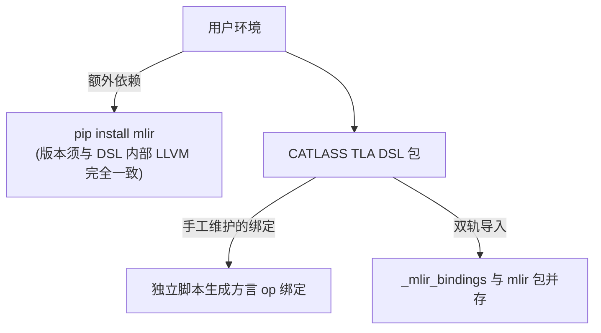
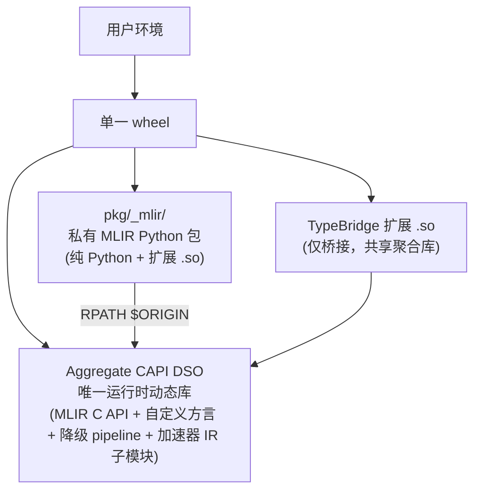
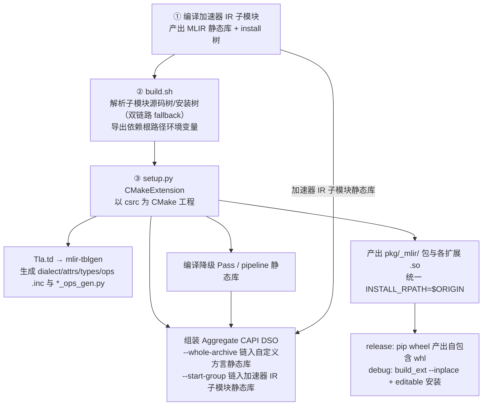
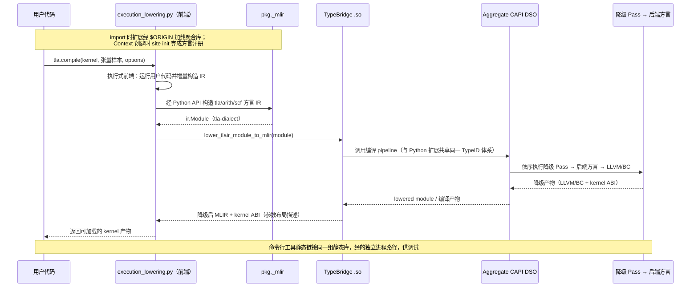
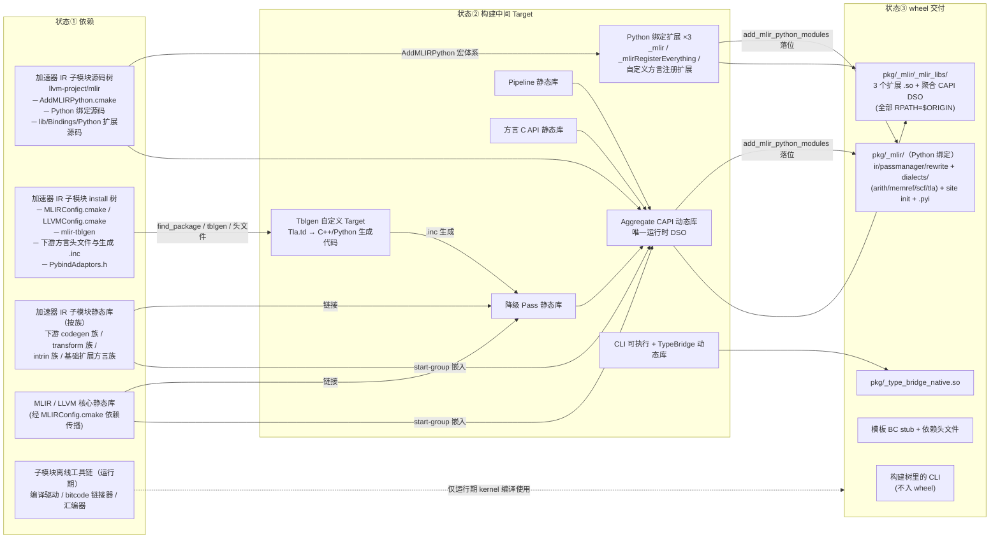
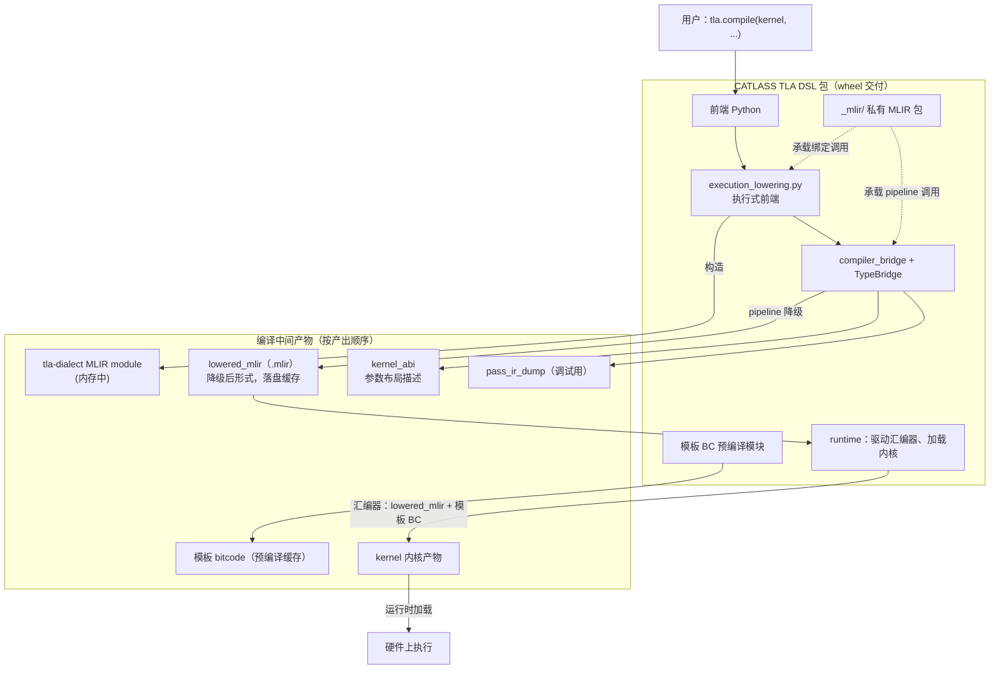

# CATLASS TLA DSL 的 MLIR 自包含集成

以 CATLASS TLA DSL——一个面向 AI 加速器的执行式 DSL——为例，MLIR bindings 的集成方式可从「依赖外部 mlir 包」改造为「单一 wheel 自包含」，同时整条编译链路也随之收敛。MLIR 打包机制本身（三层架构、AddMLIRPython.cmake、私有命名空间、聚合 CAPI）见《[MLIR Python Bindings 打包机制解析](/posts/mlir-python-packaging/)》。

<!-- more -->

---

## 一、既有集成方式的三个结构性问题

改造前，MLIR bindings 的集成方式如下：



| 问题 | 具体表现 |
| --- | --- |
| **外部版本耦合** | 用户必须安装与 DSL 编译时所用 LLVM 哈希严格匹配的 `mlir` 包，小版本偏差即 import 失败或 C API 不兼容 |
| **分发不自包含** | wheel 仅含 DSL 本体，运行时依赖外部包，部署易错 |
| **绑定双轨制** | 自定义方言的 op 绑定经由独立生成脚本生成，与 MLIR 官方 ODS 体系脱节；两套导入路径并存，维护成本高 |

## 二、目标

| 目标 | 达成方式 |
| --- | --- |
| 单一 wheel 自包含 | `pip install` 后即可用，无外部 MLIR 包依赖 |
| 版本锁定 | MLIR/LLVM 版本由加速器 IR 子模块锁定，不随上游漂移 |
| 命名空间隔离 | 导入路径统一为 `pkg._mlir.*`，与环境里任何 `mlir` 包物理隔离 |
| 绑定体系统一 | 自定义方言并入 ODS/TableGen 生成体系，废弃独立脚本 |
| 注册唯一性 | 全进程单一 MLIR C API 副本，消除重复 TypeID 崩溃风险 |

目标架构：



背景说明：CATLASS TLA DSL 的 MLIR 本体不直接取自 llvm-project 上游，而是经由加速器 IR 子模块获取——其中除 MLIR/LLVM 外，还包含一族面向目标硬件的下游方言与 codegen 工具链。即经由该子模块获取 MLIR，构建前需先编译该子模块。

## 三、代码布局

```text
tla_dsl/
├── build.sh                      # 构建入口：解析依赖路径并导出环境变量
├── setup.py                      # 打包层：CMake 构建接入 wheel 流程
├── pkg/                          # DSL Python 包
│   ├── execution_lowering.py     # 执行式前端：构造 tla/arith/scf IR
│   ├── _type_bridge.py           # TypeBridge 的 Python 侧（加载 .so）
│   ├── _type_bridge_native.*.so  # TypeBridge C++ 实现（仅桥接）
│   └── _mlir/                    # 私有 MLIR 包（构建时生成，gitignore）
│       ├── ir.py / dialects/     # Python 绑定源码层
│       └── _mlir_libs/           # pybind11 扩展 + 聚合 CAPI + site init
└── csrc/                         # C++ / CMake 源码
    ├── CMakeLists.txt            # 定位加速器 IR 子模块、TableGen、包名私有化
    ├── include/Dialect/Tla/IR/Tla.td   # 自定义方言定义（单源生成 C++/Python）
    ├── lib/Dialect/Tla/          # 方言 C++ 实现
    ├── lib/Passes/               # TLA → 后端方言降级 Pass
    ├── lib/Tools/CompilePipeline.cpp   # Pass 流水线封装
    ├── lib/CAPI/Dialect/Tla.cpp  # 方言 C API
    ├── python/CMakeLists.txt     # Python bindings 组装配置
    ├── python/bindings/RegisterTlaDialect.cpp  # 方言注册扩展
    ├── python/pkg_mlir/          # 私有包手写 Python（site init 等）
    └── tools/tla-compile/main.cpp      # 独立命令行编译工具
```

## 四、构建链路



上述机制对应的代码位置：

| 机制 | 代码落点（仓库相对路径） |
| --- | --- |
| `MLIR_PYTHON_PACKAGE_PREFIX` 私有化 | `csrc/CMakeLists.txt` |
| 加速器 IR 子模块头文件/静态库校验 | `csrc/CMakeLists.txt` |
| TableGen 自定义命令 | `csrc/CMakeLists.txt` |
| AddMLIRPython.cmake 引入（注意：从源码树 include，install 树不含此文件） | `csrc/python/CMakeLists.txt` |
| 标准方言（arith/memref/scf）与核心扩展声明 | `csrc/python/CMakeLists.txt` |
| 自定义方言：`.td` + C API + 注册扩展 + site init | `include/Dialect/Tla/IR/Tla.td`、`lib/CAPI/`、`python/bindings/RegisterTlaDialect.cpp`、`python/pkg_mlir/_mlir_libs/_site_initialize_0.py` |
| 聚合 CAPI 与 `$ORIGIN` | `csrc/python/CMakeLists.txt` |
| 独立工具（静态链接，与 Python 运行时隔离） | `tools/tla-compile/main.cpp` |

同时，DSL 全部前端代码的导入路径统一收敛至私有命名空间（`from pkg._mlir import ir`、`from pkg._mlir.dialects import arith/scf/tla`）；TypeBridge 收敛为纯 Python/C++ 桥接，编译链依赖全部移入聚合 CAPI。

## 五、端到端编译数据流

以 `tla.compile(kernel, ...)` 为例：



## 六、编译全景

按「依赖 → 构建中间 Target → 最终交付」三个状态划分。加速器 IR 子模块的静态库数量较多（涵盖下游各类方言的 dialect/transform/codegen 族），图中按族归组，具体清单以 CMakeLists 为准。



两个链接细节：

- **`--whole-archive` 链入自定义方言静态库、`--start-group` 链入子模块静态库**：前者是为了保证注册用的静态初始化代码不被链接器丢弃；后者是子模块静态库之间存在环形依赖，需要让链接器反复解析。
- **命令行工具静态链接同一组静态库**：与 Python 运行时进程隔离，调试 pass 流水线时无需启动 Python 进程。

## 七、运行期：包结构与 kernel 编译产物



| 产物 | 产生时机 | 作用 |
| --- | --- | --- |
| tla-dialect MLIR module | 执行式前端运行用户代码期间 | DSL 语义的首层 IR 表示，全程驻留内存 |
| `lowered_mlir` | 降级 pipeline 完成后 | 自定义方言已降为后端方言形式，落盘缓存，重复编译可复用 |
| `kernel_abi` | 同上 | kernel 参数布局描述，运行时按 ABI 传参 |
| `pass_ir_dump` | 开启 Pass 打印选项时 | 各 Pass 前后的 IR 快照 |
| 模板 bitcode | 部署后首次执行时预编译并缓存 | 汇编器需要的模板 BC（按 core 类型与架构区分），哈希 manifest 管版本 |
| kernel 内核产物 | 汇编器以 `lowered_mlir` + 模板 BC 生成 | 最终可加载执行的内核二进制 |

## 八、小结

1. **版本锁定靠子模块**：MLIR/LLVM 锁定在加速器 IR 子模块中，升级子模块后重新编译即可，不受 PyPI 无官方包的影响。
2. **新方言的绑定成本接近于零**：编写 `.td` 后，tblgen 同时产出 C++ `.inc` 与 Python `_ops_gen.py`，两端始终一致。此前以独立脚本维护绑定的方式是主要的维护负担来源。
3. **聚合 CAPI 是方案的必要条件**：存在两个以上扩展时必须聚合，否则 TypeID 冲突必然出现。
4. **排查导入问题时优先检查生成文件**：Python 侧报 op 不存在，通常因构建后生成文件未更新，而非绑定定义错误。
